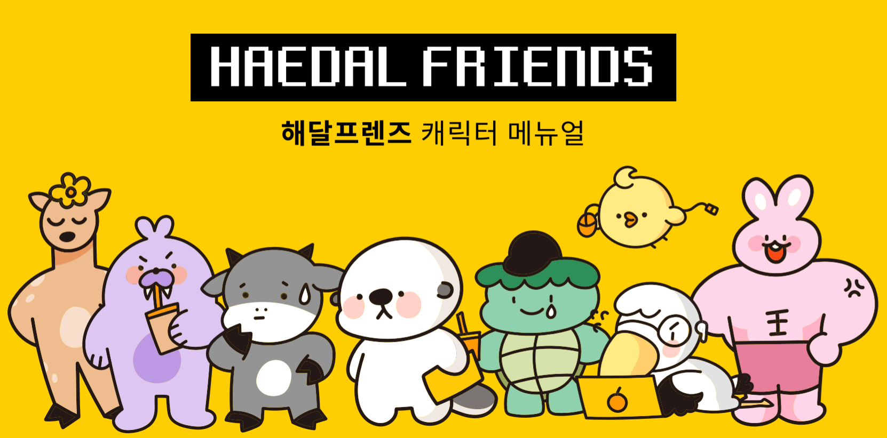

HDTI 개발자 유형
==
#### 총 16개 유형 중 8개만 작성했습니다.(나머지는 O0sun님께서..)
***
## 해달캐릭터 참고

왼쪽부터 **사스미 시라용 흐규 해달이 부기 아리 매기 김두근**
***
### AREI : 괴짜프로그래머형
캐릭터 - 매기  
스스로 개발하는 자기 자신을 보며 뿌듯해하는 전형적인 코딩덕후이다. 늦은 저녁 맥주를 마시며 노트북 앞에 앉아 코딩하는 것을 즐긴다.  
자기 주장이 강하고 고집이 센 편이어서 협업 프로젝트를 하게 되었을 때, 혼자 모든 일을 떠맡게 되는 경우가 많지만 힘들어하면서도 꿋꿋이 해내는 모습을 보이며 주변인을 놀라게한다.  
개발할 때는 생각나는 대로 폭풍처럼 코드를 작성하지만, 이 유형의 사람들은 오류가 났을 때 새로 코드를 작성할 자신이 있다.
### AREP : 소심한 아이디어뱅크형
캐릭터 - 흐규
### ARCI : 에디슨형
캐릭터 - 사스미
### ARCP : 극한의 효율형
캐릭터 - 해달이
### AFEI : 코딩계 마당발형
캐릭터 - 김두근
### AFEP : 지옥에서 온 개발자형
캐릭터 - 시라용
### AFCI : 내일은 코딩왕형
캐릭터 - 아리
### AFCP : 꾸준한 거북이형
캐릭터 - 부기
